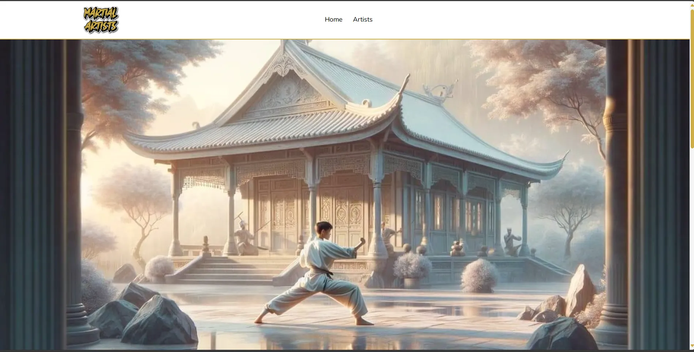
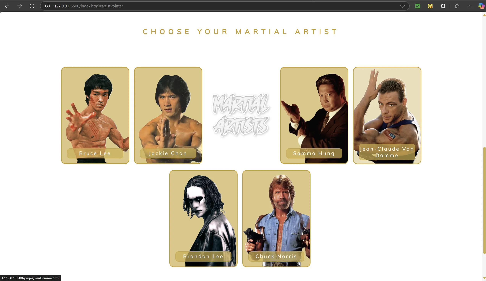
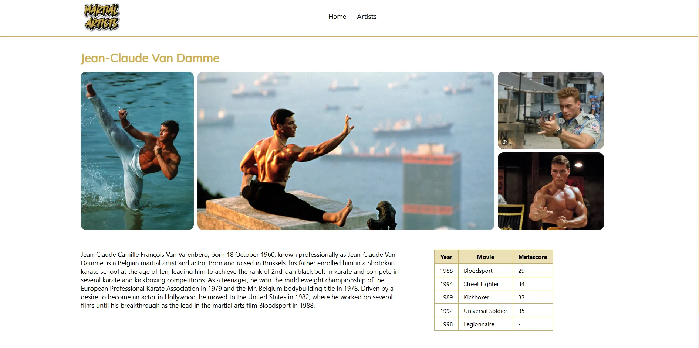

## 📄 Description

This website is dedicated to showcasing information about famous martial artists from the 1980s and 1990s. 
Users can explore detailed profiles of legendary martial artists who left an indelible mark on the world of martial arts and pop culture.

* No frameworks
* No AI code
* Local content

The website is optimized for a 16" 2560x1600 display with a 16:10 aspect ratio.

## 📷 Screenshots

  

